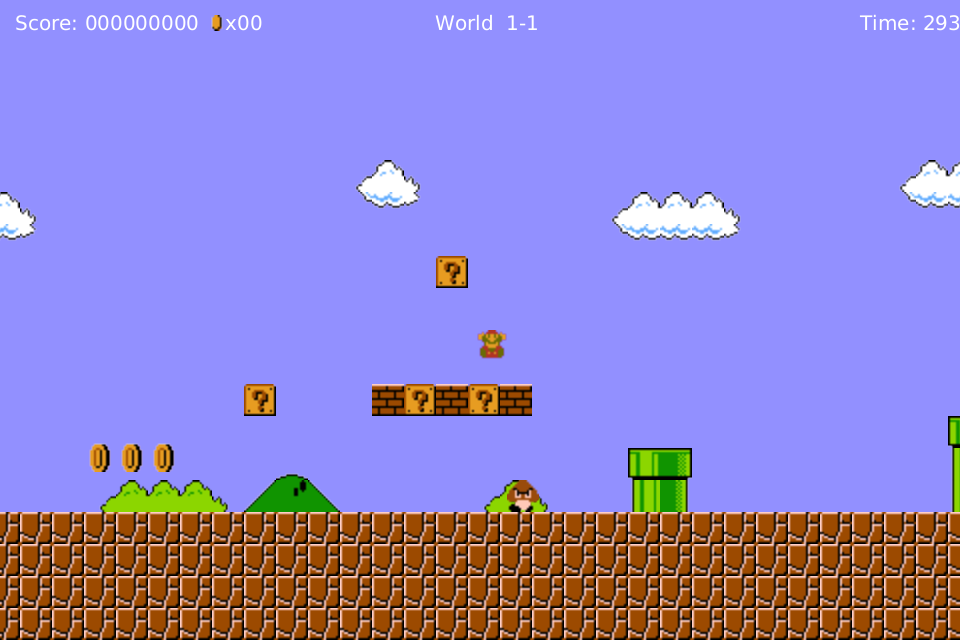

---
export_on_save:
    phantomjs: "pdf"
---

# Developerhandbuch

## Software Requirements Specification

### Installation
Das Programm bedarf keiner Installation. Die gelieferte jar-Datei kann auf einem Windows 10 x86_64 bit Rechner mit 8 GB RAM und Java 8 direkt ausgeführt werden.

### Essentielle Kriterien
-   Die Spielfigur muss sich bewegen können.
-   Die Spielfigur muss springen können.

 

-   Beim Kontakt mit Gegnern und durch Herabfallen in Abgründe verliert der Spieler.

 

<!-- PAGE BREAK -->

-   Es muss ein Menü vorhanden sein.

   

 

-   Das Spiel muss Soundeffekte besitzen.
    -   Das Spiel besitzt Soundeffekte und Hintergrundmusik.

-   Im Laufe der Entwicklung wird es eine unerwartete Requirement-Änderung geben.
    -   Es wurden Powerups implementiert.

 

-   Es muss eine Model-View-Controller-Architektur mit strikter Aufgabentrennung angewandt werden.
    -   Es wurde das MVC-Pattern angewendet. Siehe Absatz 4.

<!-- PAGE BREAK -->

### Bedingt notwendige Kriterien
-   Das Spiel besitzt ein Ende

 

-   Es gibt Blöcke mit denen die Spielfigur interagieren kann.
    -   Siehe "Unerwartete Requirement-Änderung".

-   Der Charakter kann Münzen einsammeln.

 

-   Das Spiel besitzt verschiedene durchspielbare Instanzen.

 

-   Die Spielfigur erhält Animationen.
    -   Siehe andere Punkte.

<!-- PAGE BREAK -->

### Optionale Kriterien

-   Der Spielverlauf kann gespeichert werden.
    -   Nicht erfüllt.

-   Im Spielverlauf können verschiedene Power-Ups eingesammelt werden.
    -   Siehe Essentielle Kriterien.

-   Die erreichte Punktzahl wird am Ende des Spiels in einer Rangliste gespeichert.
    -   Nicht erfüllt.

-   Spieler besitzt mehrere Leben
    -   Nicht erfüllt.

### Abgrenzungskriterien

-   Es sollen keine Graphiken erstellt werden.
    -   Es wurden die Originalgraphiken von 1980 verwendet.

-   Es muss kein eigener Sound kreiert werden.
    -   Es wurde der Originalsound von 1980 verwendet.

## Spezifikation der Funktionalitäten

### Qualitätsziele

-   Das Spiel soll mindestens mit einer konstanten Bildrate von 10 Bildern pro Sekunde laufen.
    -   Das Spiel läuft bei 60 FPS.

### Abnahmekriterien

-   Das Programm wurde gemäß Punkt 4.3 aus dem Pflichtenheft erfolgreich abgenommen.

<!-- PAGE BREAK -->

## Softwarearchitektur mit Komponenten und Schnittstellen

 
Der Quellcode ist in drei Packages aufgeteilt: Model, View und Controller.
Das Model enthält die für das Spiel elementaren Klassen wie `Entity` und alle Abkommen, wie auch Level und einige Enums..
Die View enthält den `Spritehandler`, die `GameView` und den `SoundHandler`.
In Controller sind die Klasse `GameController` und das Enum`Input` enthalten.
Durch obige Aufteilung wird das MVC-Pattern erfüllt und es ist eine optimale Abstraktion von Logik und GUI gegeben, sodass diese jederzeit ohne große Probleme ersetzt werden kann.

## Diagramme

 

Jedes im Spiel vorhandene Element erbt von der abstrakten Klasse Entity. Hier wird unterschieden zwischen `Block`, `LivingEntity` und `DeadEntity`. Eine `LivingEntity` entspricht allem, was gerade im Spiel *am Leben* ist, also alles, was auch angezeigt werden muss, Dazu gehören `Collectable`, `EnemyCharacter` und der `PlayerCharacter`
Desweiteren wurden einige Enums definiert, mit deren Hilfe z.B.`Event` wie der Tod, das Springen und das Blockzerstören oder `Input` eine Hardwareunabhängige Kommunikation zwischen `GameView` und `GameController` definiert bzw. ermöglicht wird. Es wurde eine `KI` für Gegner implementiert, um diese sich automatisch bewegen zu lassen. Das `GameModel` hält im Groben alle Abkommen von `Entity`.

## Typische Benutzungs-Szenarien

Das Programm wird ausgeführt um Spaß zu haben.

<!-- content -->

## Zeitplan

