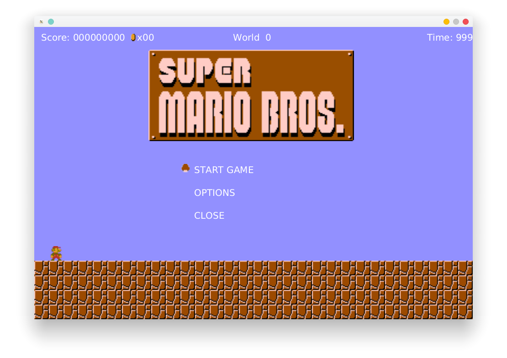
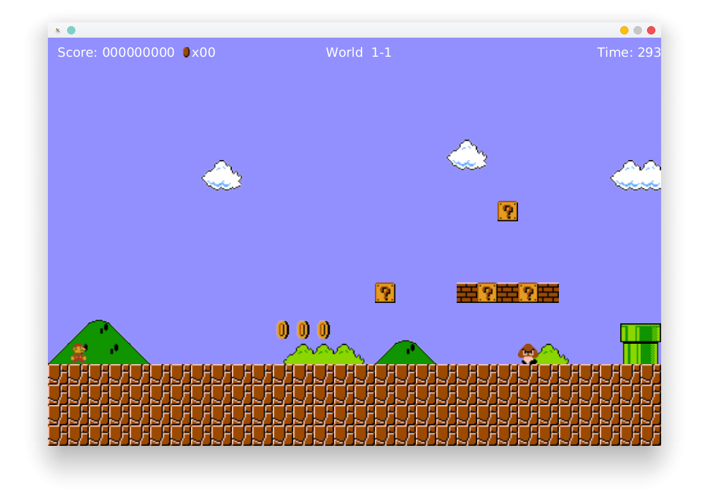
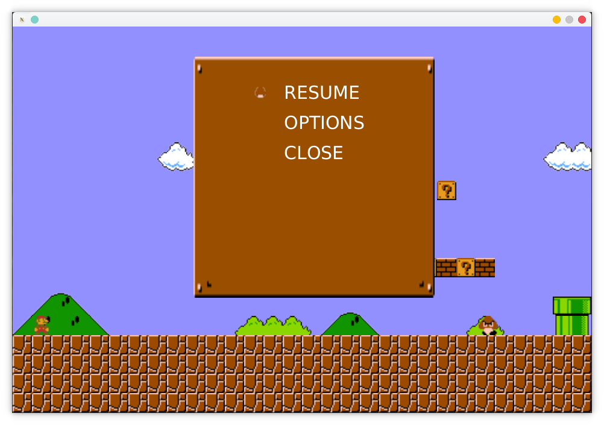

---
export_on_save:
    phantomjs: "pdf"
---

# Benutzerhandbuch Marioreimplementation

## 1.  Beim Spielstart gelangt man zum Startmenü.

 

Die Steuerung erfolgt über die Tasten &#9420;, &#9416; und &#9166;. 
&#9420;: Wählt die nächsthöhere Option aus, wobei
"Start Game" die oberste auswählbare Option ist. 
&#9416;: Wählt die nächstniedrigere Option aus, wobei "Highscore" die niedrigste auswählbare Option ist. 
&#9166;: Bestätigt die Auswahl und führt die im Folgenden definierte Aktion aus.

-   
      Startet den Spielablauf. Der Spieler betritt das Spiellevel.

-   
          Öffnet ein Optionenmenü das im Dokument weiter unten definiert wird.

-   
          Schließt das Fenster und beendet das Programm.

<!-- PAGE BREAK -->

## 2.  Das Spiel

Nach der Auswahl von "Start Game" gelangt man zum Spielbildschirm.

Die Steuerung erfolgt über die Tasten &#9398;, &#9401;, &#9251; und &#9243; 
&#9398;: Der Spieler bewegt sich mit der Spielfigur nach links, bis die linke Grenze erreicht ist oder der Charakter tot ist. 
&#9401;: Der Spieler bewegt sich mit der Spielfigur nach rechts, bis das Ziel erreicht ist oder der Charakter tot ist. 
&#9251;: Der Spieler springt. Und kann beim Landen Gegner töten. 
&#9243;: Das Spielmenü wird aufgerufen. 
Der Charakter stirbt, sobald er in einen Abgrund fällt oder einen Gegner nicht von oben berührt.
Im oberen Bereich werden Punktezahl, eingesammelte Münzen und die verbleibende Zeit angezeigt.
Münzen geben dem Spieler 100 Punkte, genauso wie getötete Gumbas.

<!-- PAGE BREAK -->

## 3.  Das Spielmenü
Wird im Spielbetrieb die Taste &#9243; gedrückt, so wird das Spiel pausiert und das Spielmenü dargestellt.

 

Wie im Startmenü auch, erfolgt die Steuerung über die Tasten &#9420;, &#9416; und &#9166;. 
&#9420;: Wählt die nächsthöhere Option aus, wobei
"Start Game" die oberste auswählbare Option ist. 
&#9442;: Wählt die nächstniedrigere Option aus, wobei "Highscore" die niedrigste auswählbare Option ist. 
&#9166;: Bestätigt die Auswahl und führt die im Folgenden definierte Aktion aus.

-   
         Setzt das aktuelle Spiel dort wo es pausiert wurde fort.

-   
          Öffnet ein Optionenmenü das im Dokument weiter unten definiert wird.

-   
          Schließt das Fenster und beendet das Programm.
